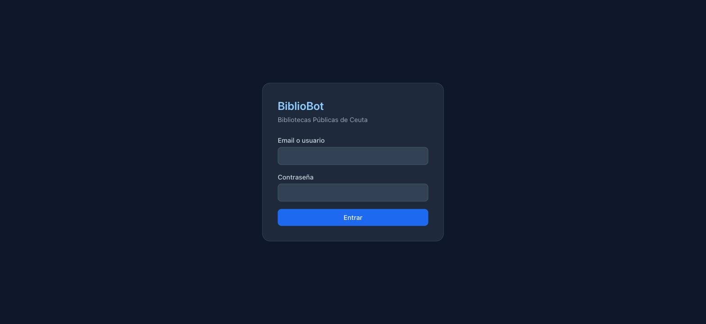
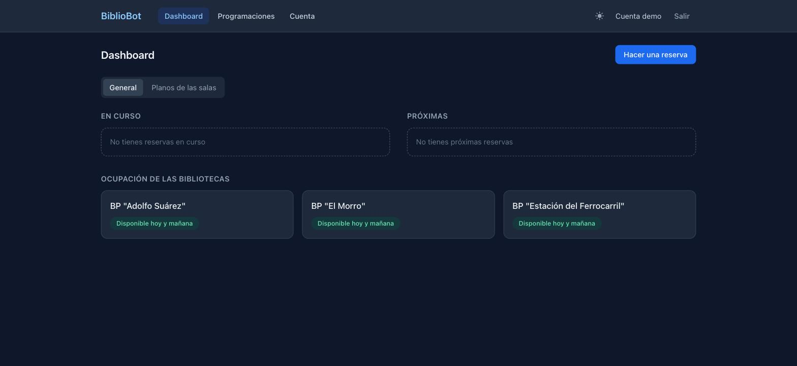
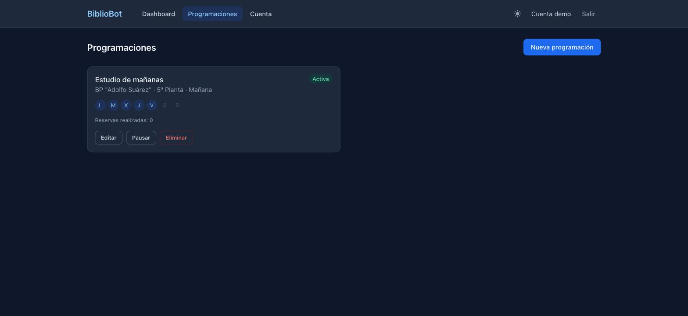
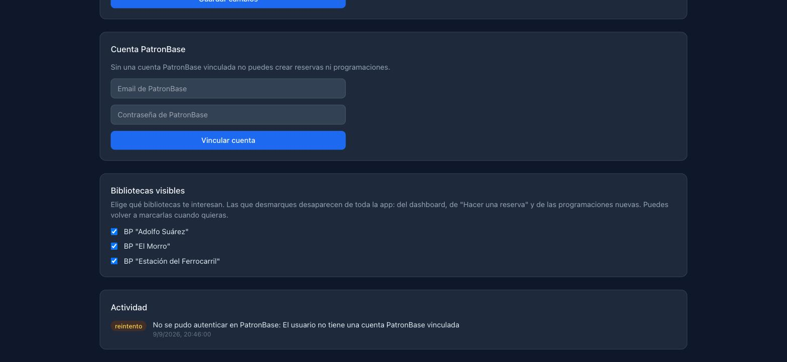
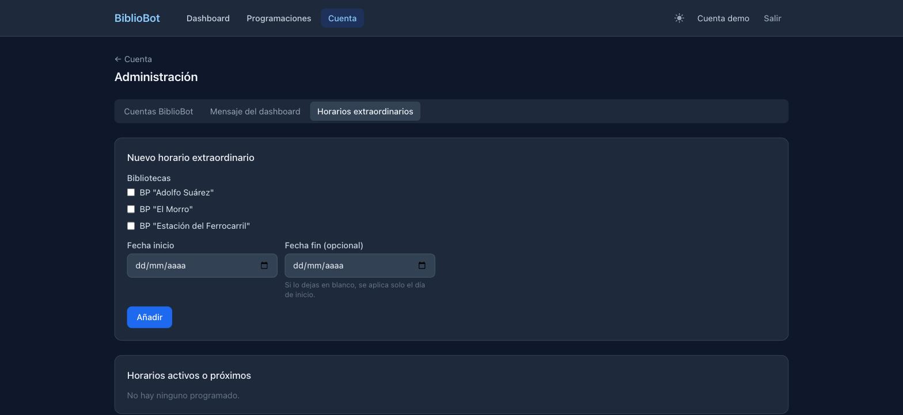

# BiblioBot

Aplicación web que automatiza la reserva de puestos de estudio en las bibliotecas públicas de Ceuta (Adolfo Suárez, El Morro y Estación del Ferrocarril), que gestionan su cita previa a través de [PatronBase](https://es.patronbase.com/_BibliotecaCeuta/Productions).

BiblioBot ofrece una interfaz propia por encima del sistema oficial: reservas puntuales con mapa de asientos en vivo, y **programaciones recurrentes** que reservan automáticamente el mismo puesto cada día en el instante exacto en que PatronBase abre el hueco.

## Capturas

Vista con una cuenta de demostración sin datos reales.



| Dashboard | Programaciones |
|---|---|
|  |  |

| Cuenta (bibliotecas visibles + actividad) | Horarios extraordinarios (admin) |
|---|---|
|  |  |

## Por qué existe

PatronBase solo permite reservar con un día de antelación, y el hueco de cada día se abre a una hora fija (normalmente las 07:00). Para alguien que estudia en la biblioteca a diario, eso significa entrar manualmente cada mañana a pelear por el mismo asiento. BiblioBot automatiza ese proceso.

## Funcionalidad

- **Dashboard**: reservas en curso y próximas (leídas directamente del historial real de PatronBase, con enlace a cada una en PatronBase) arriba, estado de ocupación en vivo de las bibliotecas abajo, planos de las salas y avisos de horarios extraordinarios. El layout aprovecha el espacio en escritorio y se adapta a una columna en móvil.
- **Reserva puntual**: asistente paso a paso (biblioteca → turno → día → mapa de asientos en vivo → confirmación) que ejecuta la reserva real contra PatronBase, con una cesta para reservar varios turnos de una vez.
- **Programaciones**: crea una regla con nombre propio ("Estudio de mañanas") que reserva un asiento fijo (con alternativo si el preferido no está libre), mañanas y/o tardes, en los días de la semana que elijas. Un motor en segundo plano la ejecuta automáticamente cada día en cuanto PatronBase abre el hueco, con reintento si falla. Las programaciones ya creadas se pueden editar por completo, no solo pausar o borrar.
- **Bibliotecas visibles**: cada cuenta puede ocultar las bibliotecas que no le interesan — desaparecen del dashboard, del asistente de reserva y de las programaciones nuevas, dejando más espacio a las que sí usas.
- **Cuenta**: vinculación de las credenciales de PatronBase (cifradas en base de datos), login por email sin distinguir mayúsculas de minúsculas, historial de actividad del bot (éxitos, fallos, reintentos).
- **Administración**: gestión de cuentas de usuario, mensaje del dashboard, horarios extraordinarios (rango de fechas, varias bibliotecas a la vez con su propio texto en Markdown cada una) — solo visible para administradores.
- **Modo oscuro** y diseño **responsive** (escritorio y móvil).

## Cómo funciona por dentro

PatronBase no es una SPA: es una aplicación clásica renderizada en servidor (formularios HTML + un par de endpoints AJAX). El adaptador de BiblioBot (`backend/src/patronbase/`) no usa un navegador headless — hace peticiones HTTP directas manteniendo su propia cookie de sesión, y parsea el HTML con `cheerio`. Esto lo hace mucho más ligero que una solución basada en Playwright/Puppeteer.

El motor de programaciones (`backend/src/schedules/engine.ts`) es un cron que revisa cada minuto si hay programaciones que deban dispararse hoy, valida las reglas de negocio de cada biblioteca (por ejemplo, Adolfo Suárez no admite reservas en fin de semana por la tarde) y ejecuta la reserva real.

Las consultas de solo lectura más pesadas (ocupación general del dashboard, estado de turnos al reservar) usan una caché en memoria "stale-while-revalidate" (`backend/src/libraries/cache.ts`): si el último dato sigue fresco se sirve sin volver a scrapear PatronBase; si está desactualizado se sirve igual al momento y se refresca en segundo plano. Nada que decida una reserva real (mapa de asientos, checkout) pasa por esta caché — eso siempre se pide en vivo, justo antes de retener o confirmar un asiento.

## Stack técnico

| | |
|---|---|
| **Backend** | Node.js + TypeScript, Express, Prisma + SQLite |
| **Automatización PatronBase** | `fetch` nativo + cookie jar propio + `cheerio` (sin navegador headless) |
| **Frontend** | React + Vite + TypeScript + Tailwind CSS |
| **Auth** | JWT en cookie httpOnly |
| **Programaciones** | `node-cron` |
| **Despliegue** | Docker Compose (backend Node ligero + frontend estático servido por nginx) |

## Puesta en marcha

Requiere [Docker Desktop](https://www.docker.com/products/docker-desktop/) instalado y en ejecución.

```bash
git clone https://github.com/tronarite/BiblioBot-Ceuta.git
cd BiblioBot-Ceuta
cp .env.example .env
```

Edita `.env` y genera dos secretos aleatorios:

```bash
openssl rand -hex 32   # para JWT_SECRET
openssl rand -hex 32   # para CREDENTIALS_ENC_KEY
```

Levanta la aplicación:

```bash
docker compose up --build -d
```

Abre `http://localhost:8080`. Como es la primera vez que arranca, verás la opción de crear la cuenta de administrador (solo disponible mientras no exista ningún usuario).

### Acceso desde el móvil

La app también funciona desde el móvil si está en la misma red WiFi que el ordenador: entra a `http://<IP-local-del-ordenador>:8080` (por ejemplo `http://192.168.1.50:8080`). La IP local se puede consultar con `ipconfig getifaddr en0` en macOS.

## Variables de entorno

Ver `.env.example` para la lista completa comentada. Las imprescindibles:

| Variable | Descripción |
|---|---|
| `JWT_SECRET` | Firma los tokens de sesión de BiblioBot. |
| `CREDENTIALS_ENC_KEY` | Cifra (AES-256-GCM) las credenciales de PatronBase guardadas en base de datos. |
| `DATABASE_URL` | Ruta del fichero SQLite (no tocar en Docker). |
| `PATRONBASE_BASE_URL` | Instancia de PatronBase a automatizar. |
| `SCHEDULE_RETRY_DELAY_MINUTES` | Minutos de espera antes de reintentar una reserva programada fallida. |
| `COOKIE_SECURE` | Déjalo en `false` mientras la app se sirva por HTTP plano (incluido el acceso por IP local desde el móvil). Solo pon `true` si hay HTTPS delante — si no, la sesión dejará de funcionar fuera de `localhost`. |

## Estructura del proyecto

```
backend/
  src/
    auth/                  Login, bootstrap del primer administrador, JWT
    patronbase/             Adaptador HTTP a PatronBase (sesión, scraping, reservas)
    patronbaseAccount/      Vinculación de credenciales de PatronBase por usuario
    libraries/               Catálogo de bibliotecas/plantas/turnos, disponibilidad en vivo
    reservations/            Reserva puntual (mapa de asientos, checkout)
    schedules/               Programaciones + motor cron + reglas de negocio
    activity/                Registro de actividad del bot
    admin/                   Mensaje del dashboard, horarios extraordinarios, usuarios
frontend/
  src/
    pages/Dashboard/         Disponibilidad, reservas, asistente de reserva puntual, planos
    pages/Programaciones/    Listado y asistente de creación de programaciones
    pages/Cuenta/            Perfil, vínculo PatronBase, actividad, administración
    components/              Piezas reutilizables (panel a pantalla completa, mapa de asientos...)
```

## Limitaciones conocidas

- No hay función de cancelación de reservas dentro de la app: hay que contactar directamente con la biblioteca (email/teléfono/WhatsApp), igual que exige PatronBase.
- Los planos de sala con foto solo existen para las 3 plantas de BP "Adolfo Suárez"; El Morro y Estación del Ferrocarril no tienen imagen de apoyo al crear una programación.
- Sin tests automatizados: el adaptador depende de la estructura HTML actual de PatronBase, y un cambio en el sitio real podría romper el scraping silenciosamente.

## Aviso

Este proyecto automatiza un sistema de terceros (PatronBase) usando las credenciales personales del propio usuario, para su propio uso. No está afiliado a la Ciudad Autónoma de Ceuta ni a PatronBase.
